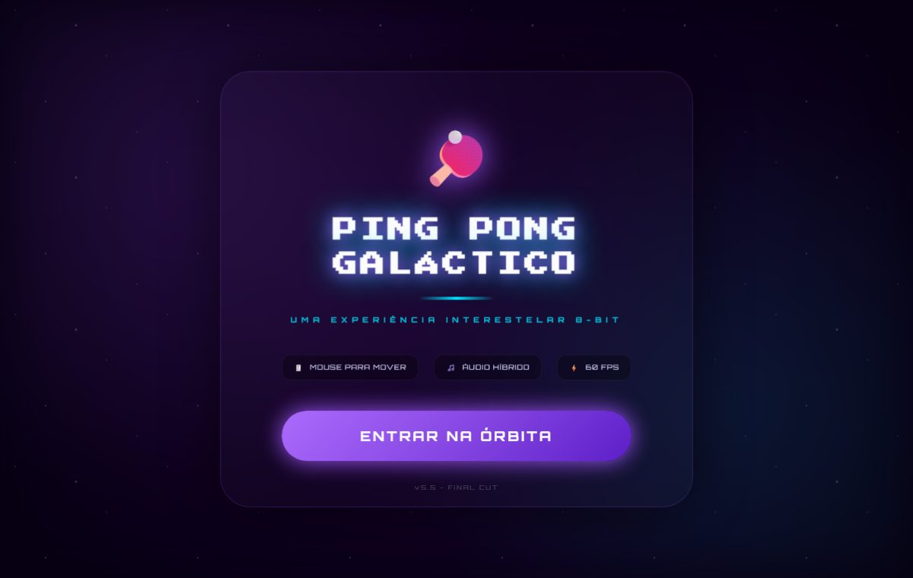

<div align="center">

# Jogo de Ping Pong

Jogo clássico de ping pong para navegador, construído com p5.js: física de colisão, placar em tempo real, trilha sonora e partidas diretamente na tela inicial, sem instalação.




**[Ver Projeto](https://otavio-2507.github.io/Jogo-de-Ping-Pong/)**

</div>

## Visão geral

O projeto implementa a mecânica completa de uma partida de ping pong: movimentação das raquetes, deslocamento e aceleração da bola, detecção de colisão e contagem de pontos, tudo renderizado quadro a quadro pelo loop de desenho do p5.js. O objetivo foi exercitar lógica de jogos, renderização em tempo real e organização de estado em JavaScript.

## Funcionalidades

- Partida completa com placar atualizado em tempo real
- Detecção de colisão entre bola, raquetes e limites da tela
- Movimentação do adversário controlada por lógica própria
- Trilha sonora integrada à partida
- Tela inicial com chamada para começar o jogo
- Tipografia temática de fliperama (Orbitron e Press Start 2P)

## Decisões de projeto

Algumas escolhas que não são óbvias pelo código:

**A tela de entrada existe para destravar o áudio.** Navegador nenhum deixa um `AudioContext` tocar sem gesto do usuário. Em vez de deixar o jogo começar mudo e torcer por um clique qualquer, o botão "Entrar na órbita" é o gesto: ele cria o contexto, chama `resume()` e só então libera o menu. A splash não é enfeite — é o único ponto do fluxo em que dá para garantir que o som vai existir.

**O áudio tem plano B próprio.** `startMusic` tenta o MP3 externo e, se o autoplay for bloqueado ou o arquivo falhar, cai num sintetizador 8-bit escrito em Web Audio: melodia, baixo e percussão gerados por osciladores no próprio navegador. O jogo nunca fica em silêncio por causa de um arquivo ausente ou de uma política do navegador.

**A paleta vive em dois lugares porque o canvas não lê CSS.** Os temas trocam custom properties em `body.tema-*` para os menus, mas o p5 desenha em canvas, onde variável de CSS não chega. `CORES_TEMAS` é o espelho em JavaScript dessa mesma paleta — duplicação deliberada, e o preço de misturar interface em DOM com jogo em canvas.

**As estrelas são gradiente, não imagem.** Três camadas de `radial-gradient` animadas em velocidades diferentes (80s, 120s e 200s) produzem a profundidade do fundo sem nenhuma requisição de rede e sem sprite para carregar.

## Tecnologias

| Tecnologia | Aplicação no projeto |
| --- | --- |
| p5.js | Loop de renderização, desenho dos elementos e ciclo do jogo |
| JavaScript (ES6+) | Lógica de colisão, pontuação e estados da partida |
| HTML5 | Estrutura da página e carregamento das dependências |
| CSS3 | Estilização da moldura e da tela inicial |
| Google Fonts | Tipografia temática (Orbitron, Press Start 2P) |

## Como executar

```bash
git clone https://github.com/OTAVIO-2507/Jogo-de-Ping-Pong.git
cd Jogo-de-Ping-Pong
```

Abra o arquivo `index.html` no navegador e clique em iniciar. O p5.js é carregado via CDN, sem configuração adicional.

## Estrutura do projeto

```
Jogo-de-Ping-Pong/
├── index.html              Página do jogo
└── src/
    ├── javascript/
    │   └── sketch.js       Lógica do jogo (p5.js)
    ├── style/
    │   └── styles.css      Estilos da página
    └── audio/
        └── musica.mp3      Trilha sonora
```

